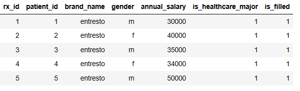
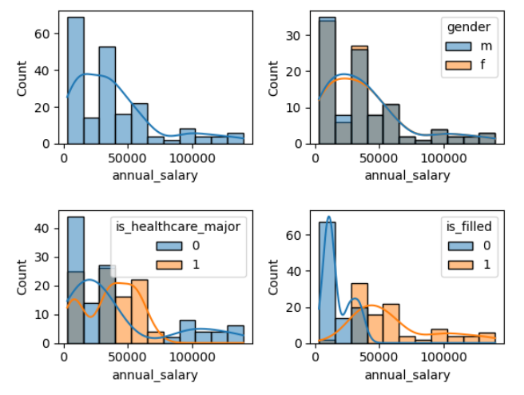
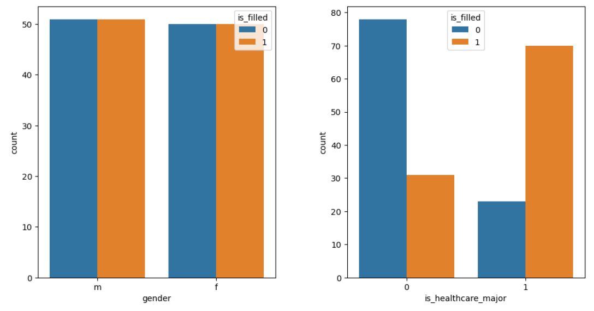

# prescription-fill-prediction

## About project

When patients don't pick up their prescriptions, they can get very sick. 
If the conditions are serious, they can end up in the hospital. 
If they have taken their medications, then they could've avoided hospitalization.
As we all know hospital bills are super expensive. 
One instance where medication inadherence triggers repeated hospital admissions is the brand drug 'Entresto' for heart failure . 
In the last few years, the brand drug has demonstrated benefits to reduce mortality and also reduce hospital admissions [(source)](https://www.acc.org/Latest-in-Cardiology/Clinical-Trials/2014/08/30/12/22/PARADIGM-HF).
However, this drug is expensive so patients might not pick it up after being prescribed. 
Data shows that poor heart failure management is a common reason why patients end up returning to hospitals[(source)](https://www.ncbi.nlm.nih.gov/pmc/articles/PMC10612439/#:~:text=the%20initial%20admission.-,Hospitalized%20patients%20with%20HF%20have%20the%20highest%2030%2Dday%20readmission,et%20al.%2C%202018) .

## About the Data set

This synthetic dataset gives information about patients characteristics like annual salary and whether they pick up their prescription of Entresto or not. There are only 7 columns. We will use the dataset to make a model to predict if  a person will pick up Enstresto or not with logistic regression.

* Attribute Information
  +	rx_id 
      +	__Meaning__: The unique ID for the prescription
      +	__Variable Type__: string
      +	__Possible values__:  any number from 1 to infinity
  +	patient_id 
      +	__Meaning__: The unique ID of the patient 
      +	__Variable Type__: string
      +	__Possible values__:  any number from 1 to infinity
  +	brand_name 
      +	__Meaning__: the name of the drug
      +	__Variable Type__: string
      +	__Possible values__:  'entresto'
  +	gender 
      +	__Meaning__: biological sex of the patient
      +	__Variable Type__: character
      +	__Possible values__:  'm' , 'f'
  +	annual_salary 
      +	__Meaning__: how much money the patient makes in a year
      +	__Variable Type__: integer
      +	__Possible values__:  10000,30000,etc
  +	is_healthcare_major
      +	__Meaning__: Was this person's college education related to healthcare?
      +	__Variable Type__: integer
      +	__Possible values__:  1 if true , 0 if false
  +	is_fill 
      +	__Meaning__: was the prescription picked up from the pharmacy?
      +	__Variable Type__: integer
      +	__Possible values__:  1 if true , 0 if false
	  

- Sample view of dataset:

  

## Patient characteristics graph 1

- Insight: We can see that the overall salary distribution is skewed to the right.
- Insight: We see that gender and healthcare major have lots of overlap so they don't seem to influence salary.
- Insight: However,there seems to be a difference in salary versus filling a medication. Higher salary seems to fill their medication versus lower salary.

## Patient characteristics graph 2

- insight: Gender doesn't seem to play a role as the proportions of filling or not are pretty even between the genders
- insight: Seems like those that were healthcare major in college would influence a person's decision to pick up the medication. Visually, we can see those that were healthcare majors in college had much high proportions of filling. Those that weren't in healthcare majors in college had much higher proportions of not filling the medication. 

## Conclusion
- Our model was about 95% accurate in predicting if an user will pick up his/her entresto.Ways of improving the model are to get more samples, more features, cross validation , hyper parameter tuning ,etc.

- The logistic regression showed that healthcare major has an impact on whether a patient fills Entresto or not. Perhaps, an intervention would be to sent an educational link to the patients that weren't in healthcare major. The link would provide more medical info about the medication and about potential dangers of uncontroll heart failure.

- Money seems to be a factor of whether a patient decides to pick up Enstreto or not. An intervention would be to contact the manufacturer for special coupons so that the patients can afford the medication.
